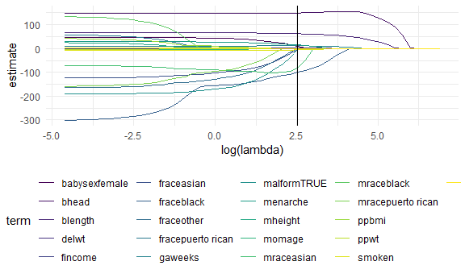
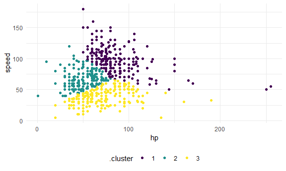

Statistical Learning
================

## Lasso

Predicting birthweight

``` r
bwt_df = 
  read_csv("data/birthweight.csv") %>% 
  janitor::clean_names() %>%
  mutate(
    babysex = as.factor(babysex),
    babysex = fct_recode(babysex, "male" = "1", "female" = "2"),
    frace = as.factor(frace),
    frace = fct_recode(frace, "white" = "1", "black" = "2", "asian" = "3", 
                       "puerto rican" = "4", "other" = "8"),
    malform = as.logical(malform),
    mrace = as.factor(mrace),
    mrace = fct_recode(mrace, "white" = "1", "black" = "2", "asian" = "3", 
                       "puerto rican" = "4")) %>% 
  sample_n(200)
```

It’s december… let’s just do the lasso and move on.

``` r
y = bwt_df %>% pull(bwt)
x = model.matrix(bwt ~ ., bwt_df)[, -1]
```

Let’s fit lasso.

``` r
lambda_grid = 10 ^ seq(3, -2, by = -0.1)

lasso_fit = glmnet(x, y, lambda = lambda_grid)

lasso_cv = cv.glmnet(x, y, lambda = lambda_grid)

lambda_opt = lasso_cv$lambda.min
```

Can we actually see what we did …?

``` r
lasso_fit %>% 
  broom::tidy() %>% 
  complete(term, lambda, fill = list(estimate = 0)) %>% 
  filter(term != "(Intercept)") %>% 
  ggplot(aes(x = log(lambda), y = estimate, group = term, color = term)) +
  geom_path() +
  geom_vline(xintercept = log(lambda_opt))
```



## Cluster pokemons

``` r
pokemon_df =
  read_csv("data/pokemon.csv") %>% 
  janitor::clean_names() %>% 
  select(speed, hp)
```

Take a quick look at our pokemons

``` r
pokemon_df %>% 
  ggplot(aes(x = hp, y = speed)) +
  geom_point()
```


Use k-means to identify clusters. (standardizing first)

``` r
kmeans_fit =
  kmeans(x = pokemon_df, centers = 3)
```

``` r
pokemon_df %>% 
  broom::augment(kmeans_fit, .) %>% 
  ggplot(aes(x = hp, y = speed, color = .cluster)) +
  geom_point()
```


